# Pertemuan Minggu 2

## Eksperimen Warm-up

**1. Hapus Expanded pada baris nama, lalu amati peringatan overflow atau perilaku layout-nya; kembalikan setelah itu.**

Penghapusan Expanded pada Baris Nama: Menyebabkan teks mengalami overflow (peringatan kuning-hitam khas Flutter) karena teks mengambil ruang tak terbatas di dalam Row.

| iPad | iPhone |
| :---: | :---: |
| 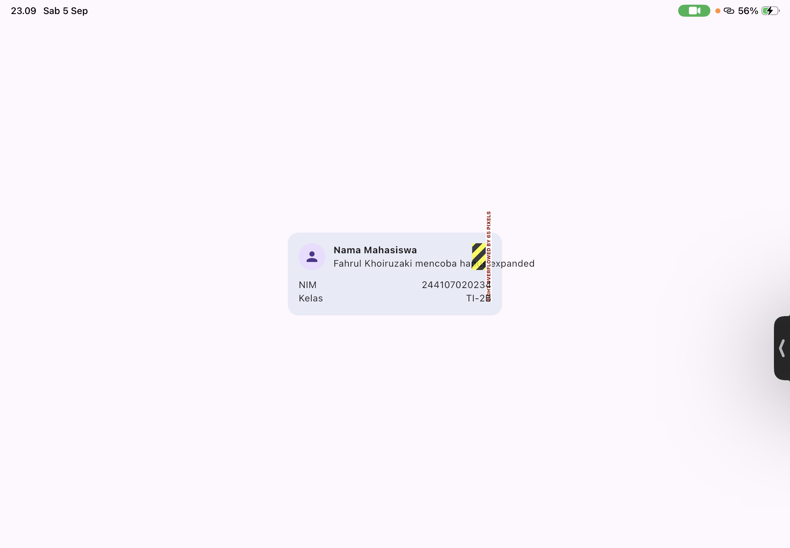 | 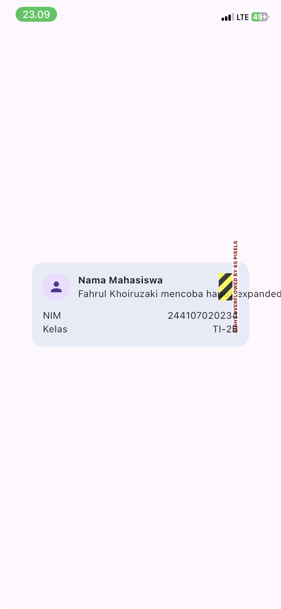 |

**2. Ganti mainAxisSize: MainAxisSize.min menjadi nilai default dan amati perubahan tinggi kartu.**

Nilai default dari mainAxisSize di Column adalah MainAxisSize.max. Ketika diubah kembali ke default, Column akan memanjang secara vertikal, beda dengan MainAxisSize.min yang membuat tinggi kartu pas dan fleksibel mengikuti banyak konten di dalamnya.

| iPad | iPhone |
| :---: | :---: |
| 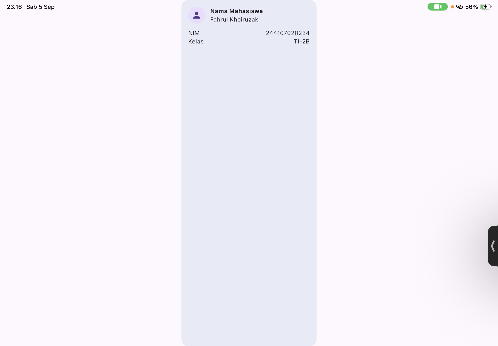 | 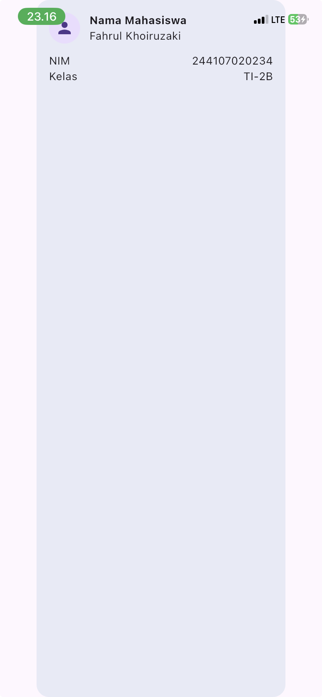 |

**3. Tambahkan satu baris data (misal Email) menggunakan pola Row + Expanded yang sama.**

| iPad | iPhone |
| :---: | :---: |
| 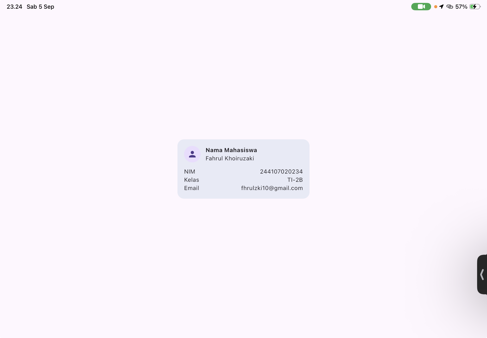 | 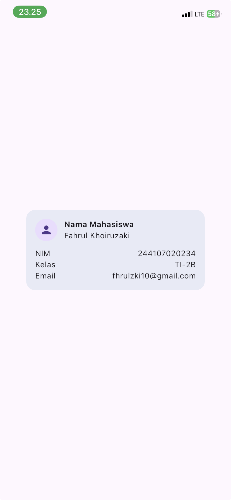 |

## Praktikum Dashboard Responsif

**Hasil praktikum dashboard responsif**

| iPad | iPhone |
| :---: | :---: |
| 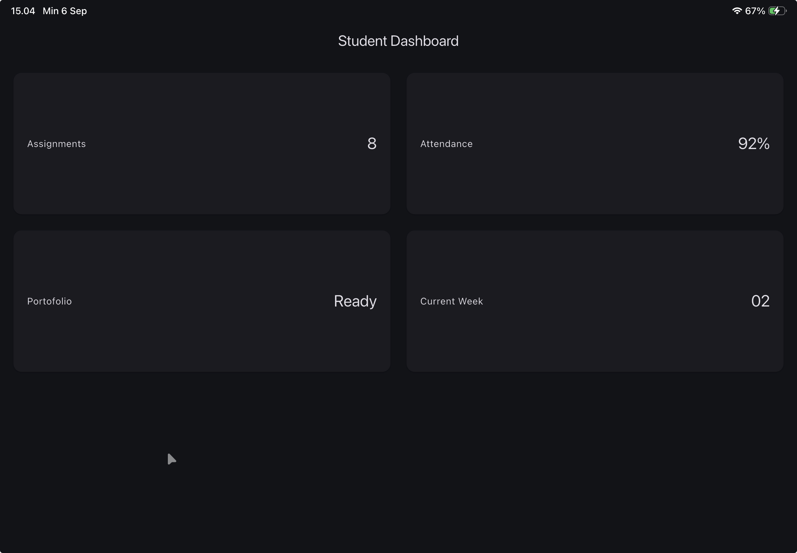 | 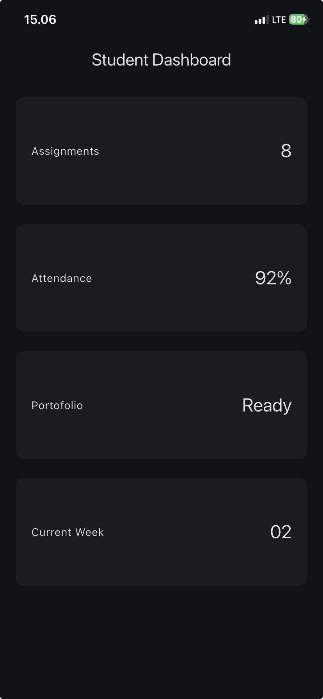 |

**Menambahkan StatefulWidget dan Cupertino**

| iPad | iPhone |
| :---: | :---: |
| 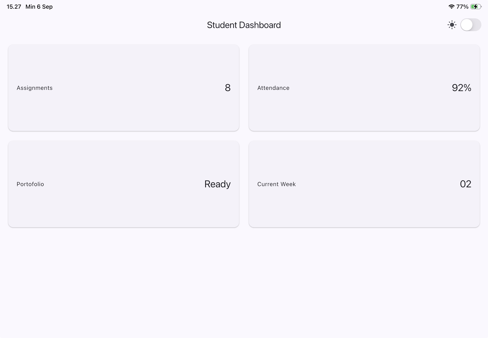 | 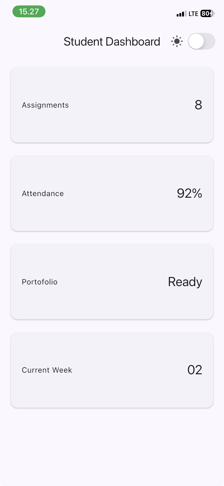 |

## Eksperimen Layout

**1. Ubah breakpoint dari 700 menjadi nilai lain dan amati perubahan jumlah kolom.**

Breakpoint digunakan sebagai batas untuk menentukan perubahan layout. Jika lebar layar memenuhi nilai breakpoint, dashboard menggunakan 2 kolom. Jika tidak memenuhi, dashboard menggunakan 1 kolom. Untuk ipad air memiliki nilai 2000 sedangkan iphone 11 memakai nilai 400 untuk bisa 2 kolom

| iPad | iPhone |
| :---: | :---: |
| 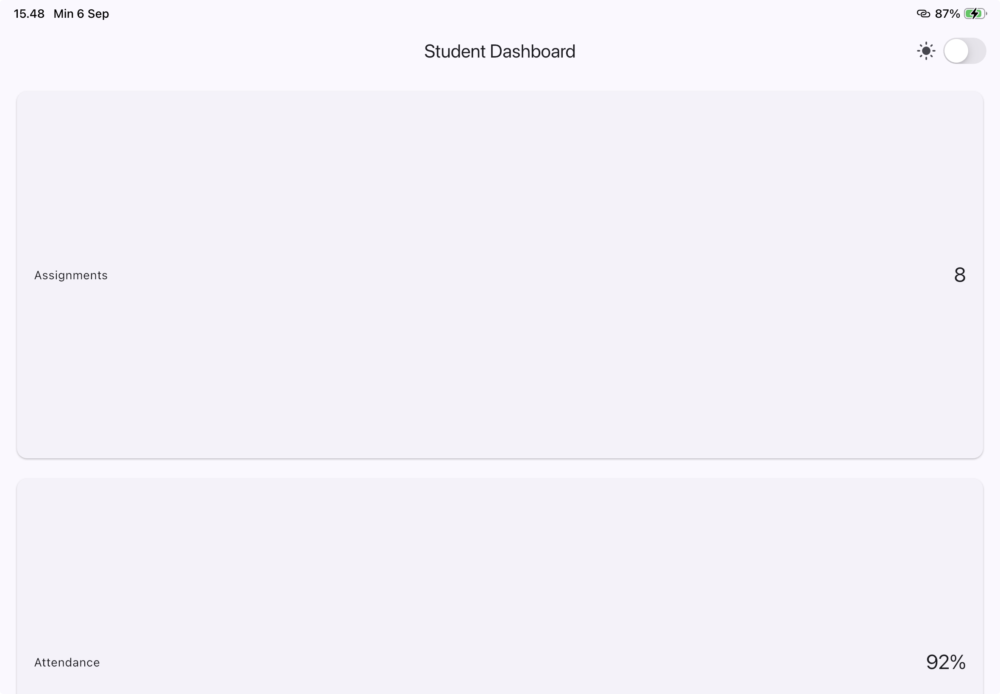 | 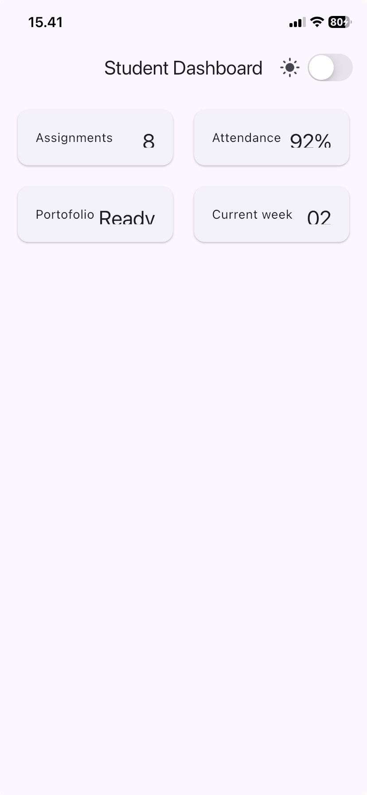 |

**2. Ubah themeMode menjadi ThemeMode.dark, lalu kembalikan ke ThemeMode.system.**

ThemeMode untuk menentukan pengaturan tema aplikasi, ThemeMode.dark dan ThemeMode.light memaksa aplikasi untuk menggunakan tema tersebut, sedangkan ThemeMode.system aplikasi akan mengikuti pengaturan device yang dipakai.

| iPad | iPhone |
| :---: | :---: |
| 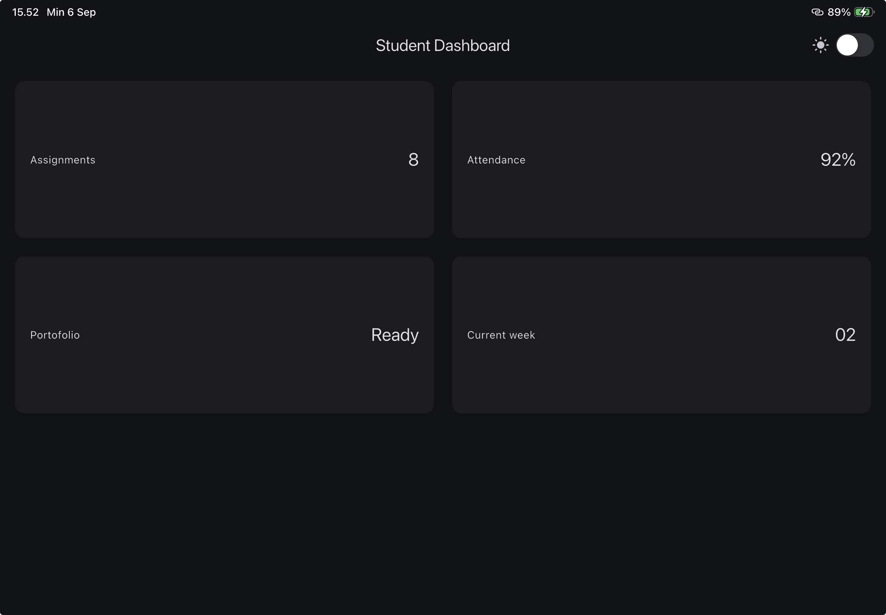 | 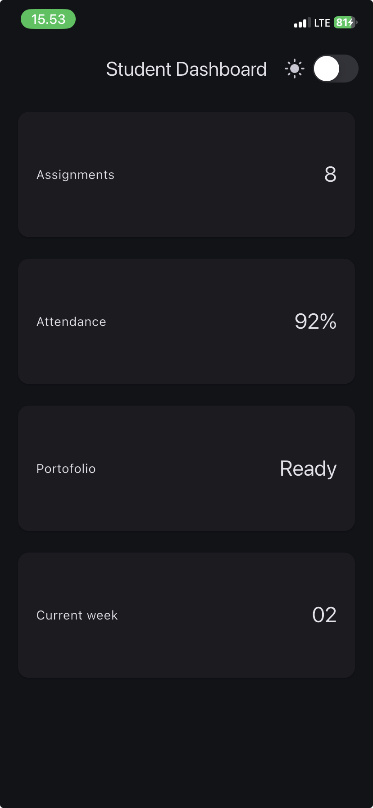 |

**3. Uji aplikasi dengan ukuran layar emulator yang berbeda.**

Hasi menunjukkan jika aplikasi bisa menyesuaikan layout mengikuti ukuran layar. Penggunaan LayoutBuilder membuat dashboard lebih responsif jadi dapat digunakan untuk perangkat yang memiliki ukuran layar berbeda.

**4. Tambahkan Semantics atau label yang bermakna pada elemen yang penting bagi screen reader.**

Semantics membantu aksesbilitas aplikasi, yang jika ditekan akan berbunyi sesuai label yang diberi. Widget yang mempunyai fungsi penting bisa diberikan label dan petunjuk sehingga lebih mudah dipahami oleh pengguna yang menggunakan screen reader.

## Tugas utama

| iPad | iPhone |
| :---: | :---: |
| 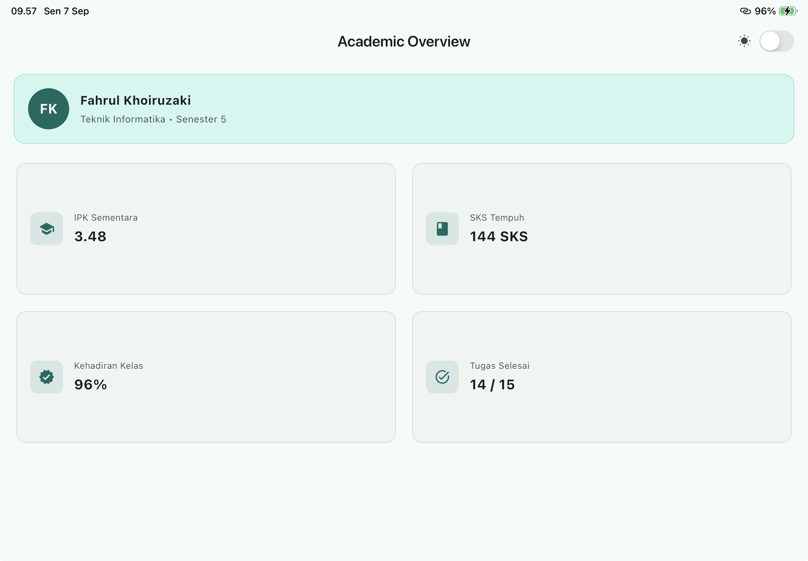 | 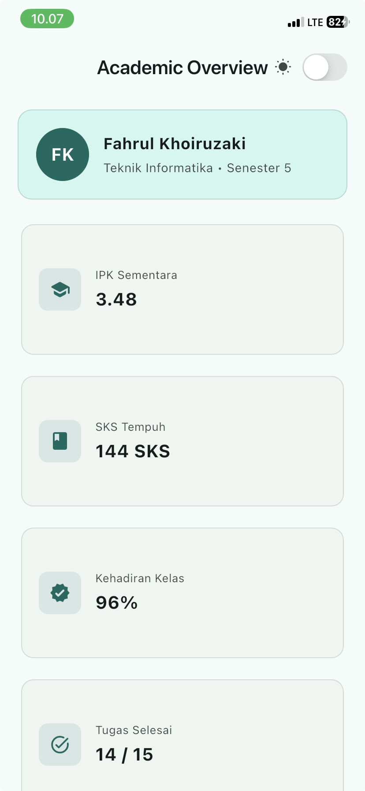 |

| iPad | iPhone |
| :---: | :---: |
| 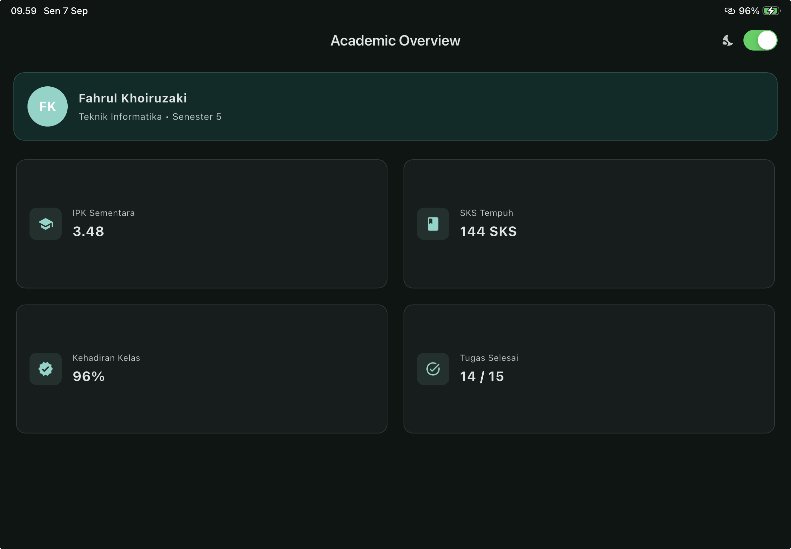 | 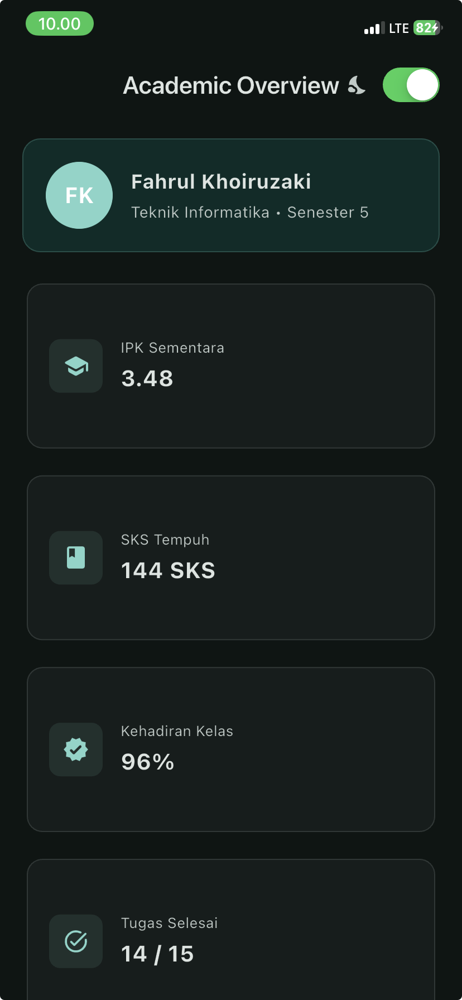 |

## AI Prompt Challenge

### Prompt 1 — Desain Layout

**Prompt:**

"Bandingkan dua tata letak dashboard akademik untuk Flutter:
versi `GridView` dan versi `LayoutBuilder` + `Column`.
Jelaskan trade-off responsif dan aksesibilitasnya."

**Keputusan:**

Saya menggunakan kombinasi `LayoutBuilder` dan `GridView`.

`LayoutBuilder` digunakan untuk menentukan breakpoint berdasarkan lebar
layar, sedangkan `GridView` digunakan untuk menyusun kartu informasi.

Pada layar sempit digunakan satu kolom, sedangkan pada layar lebar
digunakan dua kolom.

**Alasan teknis:**

- Kode lebih sederhana untuk dashboard berbasis kartu.
- Mudah mengubah jumlah kolom berdasarkan ukuran layar.
- Cocok ketika jumlah informasi bertambah.
- Tetap dapat mempertahankan aksesibilitas dengan `Semantics`.

---

### Prompt 2 — Penguatan Konsep Expanded

**Prompt:**

"Jelaskan kapan penggunaan `Expanded` justru menyebabkan overflow
di dalam `Row`, beri contoh kode yang gagal dan perbaikannya."

**Kesimpulan:**

`Expanded` digunakan untuk membuat widget mengambil sisa ruang yang
tersedia pada `Row` atau `Column`. Penggunaan yang salah dapat
menyebabkan masalah ketika parent tidak memberikan batas ukuran yang
jelas atau ketika child membutuhkan ukuran yang melebihi ruang tersedia.

Pada dashboard ini `Expanded` digunakan pada bagian teks profil dan
teks `InfoCard` agar teks menggunakan ruang yang tersisa.

---

### Prompt 3 — Verification

**Prompt:**

"Periksa kembali rekomendasi layout di atas: apakah tetap responsif
di bawah 600px, apakah mengurangi aksesibilitas, dan apakah ada widget
yang tidak tersedia di Flutter stabil saat ini?"

**Hasil verifikasi:**

Layout diuji pada ukuran layar sempit dan lebar.

- Layar sempit → satu kolom.
- Layar lebar → dua kolom.
- `Expanded` digunakan pada `Row` dengan constraint yang valid.
- `Semantics` digunakan untuk informasi penting dan toggle tema.
- Dark mode tetap menggunakan `ThemeData` sehingga warna mengikuti tema.
- Tidak terdapat widget eksperimental yang digunakan dalam layout.

## Refactoring challenge

**1. Ekstrak kartu informasi menjadi widget reusable (misal InfoCard) yang menerima title dan value, sehingga tidak ada duplikasi widget.**

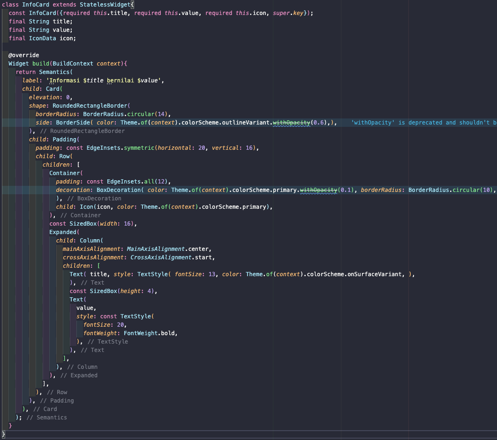

**2. Ganti warna dan ukuran yang di-hardcode dengan Theme.of(context) agar mengikuti tema terang/gelap secara otomatis.**
| 2 | 1 |
| :---: | :---: |
| 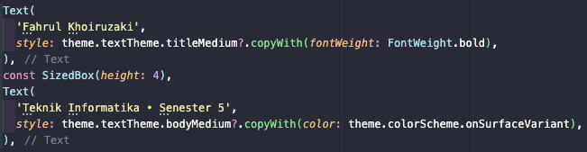 | 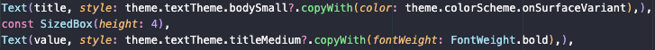 |

**3. Pindahkan breakpoint ke satu konstanta bernama (misal const kWideBreakpoint = 700;) agar hanya didefinisikan satu kali.**

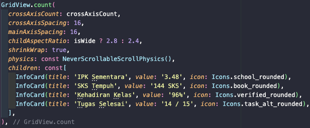

**4. Jalankan flutter analyze dan pastikan tidak ada error maupun warning baru.**

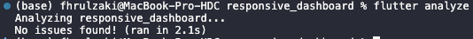

## Testing Dasar

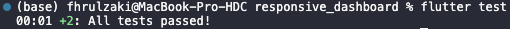

## Checklist verifikasi

- [x] `flutter analyze` tidak menghasilkan error.
- [x] `flutter test` lulus semua widget test responsif.
- [x] Aplikasi dapat dijalankan pada ukuran layar sempit dan lebar.
- [x] Dark mode memiliki kontras dan teks yang terbaca.
- [x] Struktur widget dapat dijelaskan saat code review.
- [x] Screenshot, folder `test/`, dan README sudah tersimpan pada folder tugas Week 2.

## Refleksi dan Referensi

**1. Apa perbedaan cara berpikir imperative dan declarative saat membangun UI?**

Imperative lebih fokus pada langkah untuk mengubah UI, sedangkan declarative fokus pada hasil UI yang ingin ditampilkan berdasarkan kondisi atau state.

**2. Kapan Expanded membantu dan kapan penggunaannya justru menghasilkan layout error?**

`Expanded` membantu widget mengisi sisa ruang dalam `Row` atau `Column`. Tapi, bisa menyebabkan error jika digunakan pada layout yang tidak memiliki batas ukuran yang jelas.

**3. Bagaimana breakpoint dan theme memengaruhi pengalaman pengguna?**

Breakpoint membuat dashboard menyesuaikan ukuran layar, yaitu satu kolom pada layar sempit dan dua kolom pada layar lebar. Theme membuat tampilan tetap nyaman digunakan dalam light maupun dark mode.

**4. Apa yang Anda verifikasi dari rekomendasi AI setelah tugas inti selesai?**

Saya membandingkan `GridView` dengan `LayoutBuilder + Column`, kemudian mengecek kembali responsivitas, aksesibilitas, dan penggunaan widget. Hasilnya diverifikasi dengan menjalankan `flutter analyze` dan `flutter test`.