# Pertemuan 3

## Praktikum 1 — Aplikasi multi-page dengan GoRouter

### Struktur folder:

| struktur |
| :---: |
|  |

### Definisikan router di lib/main.dart:

| main_dart |
| :---: |
|  |

### Halaman Home (lib/pages/home_page.dart):

| home_page |
| :---: |
|  |

### Halaman Detail (lib/pages/detail_page.dart):

| detail_page |
| :---: |
|  |

### Jalankan dan amati.

| home_page | detail_page |
| :---: | :---: |
|  |  |

**Penjelasan:**
Aplikasi dijalandkan dengan membuka item dari halaman Home. Waktu item dipilih, aplikasi berpindah ke halaman Detail dan menampilkan ID item yang dipilih.

Praktikum berhasil menggunakan GoRouter untuk membuat navigasi halaman. Penggunaan path parameter memungkinkan halaman Detail menerima ID item secara dinamis.

## Praktikum 2 — Aplikasi ToDo dengan Riverpod

## Struktur folder

| struktur |
| :---: |
|  |

### Bungkus aplikasi dengan ProviderScope di lib/main.dart:

| code_main |
| :---: |
|  |

### Buat state dan provider (lib/providers/todo_provider.dart):

| code_todo_provider |
| :---: |
|  |

### Tampilkan dengan ConsumerWidget (lib/pages/todo_page.dart):

| code_todo_page_1 | code_todo_page_2 |
| :---: | :---: |
|  |  |

## AsyncValue: loading, error, success

### Struktur folder:
| struktur |
| :---: |
|  |

### (lib/pages/product_page.dart):

| product_page |
| :---: |
|  |

### (lib/providers/product_provider.dart):

| product_providers |
| :---: |
|  |

### Output

| Output |
| :---: |
| 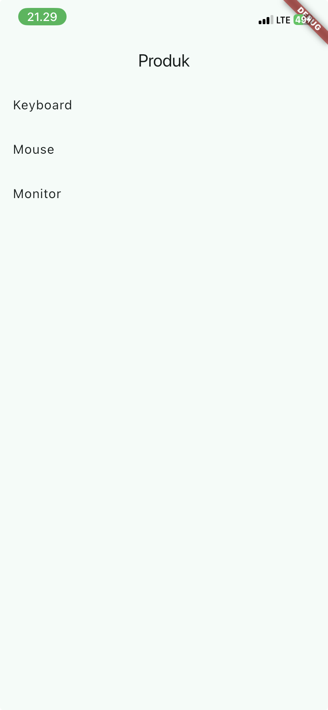 |

### Ubah build() sementara untuk melempar error:

| kode_sebelum | kode_sesudah |
| :---: | :---: |
| 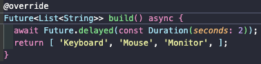 | 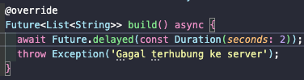 |

| Output |
| :---: |
| 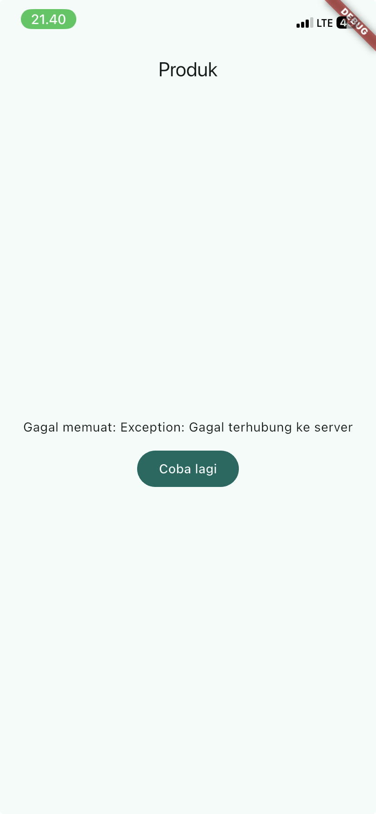 |

### Pulihkan kode

| Output |
| :---: |
| 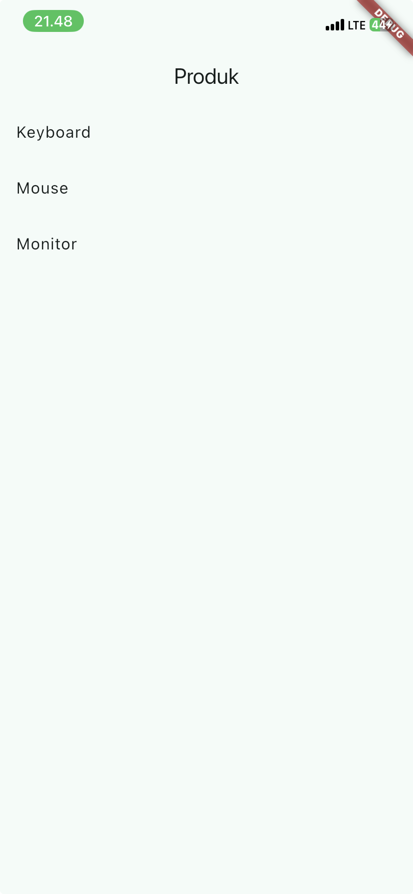 |

### Refleksi
*mengapa menampilkan ulang data lama (stale data) dengan indikator refresh kadang lebih baik daripada mengosongkan layar? Kapan pola itu penting?*

Karena menampilkan data lama dengan indikator refresh lebih bagus kareana pengguna dapat melihat informasi yang tersedia selama proses pembaruan berlangsung. Pola ini penting di aplikasi kayak marketplace, berita, atau dashboard, karena mengosongkan layar saat refresh dapat membuat aplikasi kerasa lambat dan mengganggu pengalaman seorang pengguna.

## AI Challenge

| stats_provider.dart |
| :---: |
| 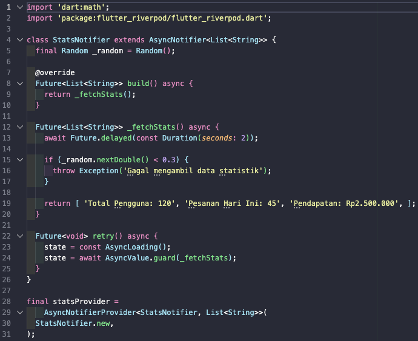 |

| stats_page.dart |
| :---: |
| 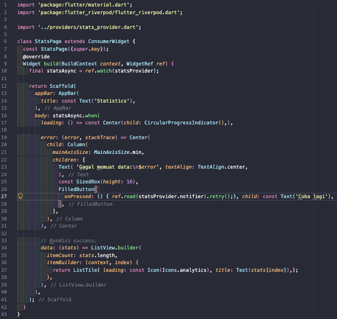 |

| main.dart |
| :---: |
| 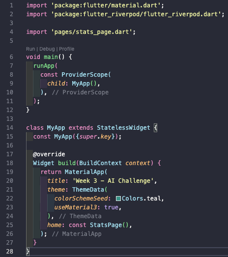 |

| stats_provider_test.dart |
| :---: |
| 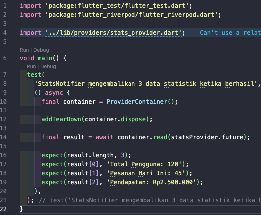 |

**Ada satu masalah**

Karena requirement-nya gagal secara acak 30%, unit test di atas secara teori bisa gagal 30% juga.
Itu jelek untuk automated testing.
Jadi perlu memperbaiki desain supaya testing deterministik.

**Hasil**

| hasil |
| :---: |
| 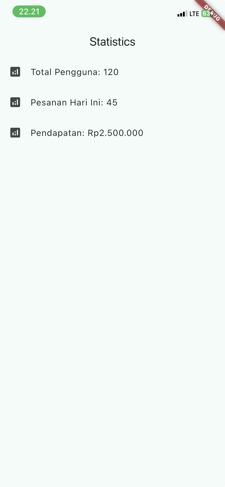 |

**Perbaikan**

| perbaikan_kode |
| :---: |
| 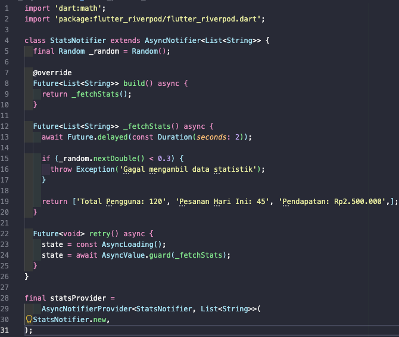 |

| flutter_analyze_test |
| :---: |
| 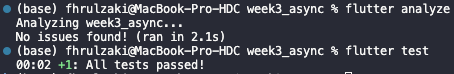 |

### Verification Checklist

* *Immutable State* — ✅ 
State dikelola menggunakan AsyncValue dan tidak dimodifikasi secara langsung dengan state.add().
* *Penggunaan ref.watch dan ref.read* — ✅ 
ref.watch() digunakan untuk memantau state di build, sedangkan ref.read() digunakan pada tombol retry.
8 *Penanganan AsyncValue* — ✅ 
UI menangani tiga kondisi: loading, error, dan success/data.
* *Provider Terdefinisi dengan Jelas* — ✅ 
Menggunakan satu AsyncNotifierProvider<StatsNotifier, List<String>> dengan tipe state yang jelas.
* *Menggunakan API Riverpod Terbaru* — ✅ 
Implementasi menggunakan AsyncNotifier dan ConsumerWidget, tanpa API Riverpod lama.
* *Pengujian dan Analisis Kode* — ✅ 
flutter analyze sudah diperbaiki hingga tidak ada issue, dan flutter test digunakan untuk memastikan kode berjalan dengan benar.

## Refactoring dan testing

### Refactoring Challenge

* **Pisahkan widget bar ToDo**

| struktur_folder |
| :---: |
| 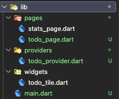 |

* **Ekstrak logika filter**

| code |
| :---: |
| 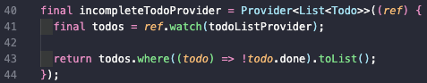 |

* **Integrasi aplikasi ToDo dengan GoRouter**

| code |
| :---: |
| 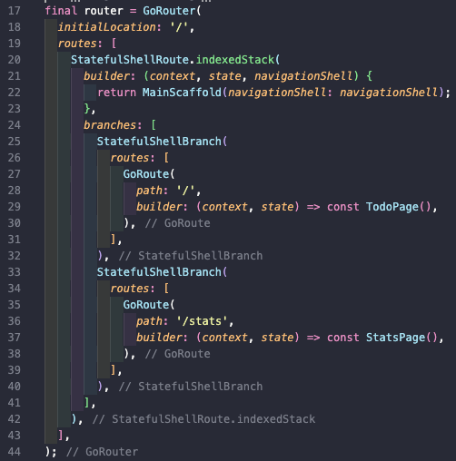 |

### Testing

| output |
| :---: |
| 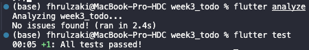 |

### Checklist verifikasi mandiri

* **Navigasi GoRouter bekerja: pindah halaman, back, dan akses path detail langsung.** ✅
* **ProviderScope membungkus root aplikasi; state ToDo bertahan saat berpindah halaman.** ✅
* **UI AsyncValue menangani loading, error, dan success, bukan hanya success.** ✅
* **flutter analyze tanpa issue dan semua test lulus.** ✅
* **Hasil AI diverifikasi dan didokumentasikan pada folder docs/.** ✅

