# Pertemuan 3

## Praktikum 1 — Aplikasi multi-page dengan GoRouter

### Struktur folder:

| struktur |
| :---: |
| 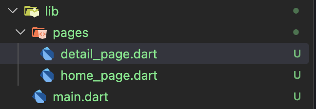 |

### Definisikan router di lib/main.dart:

| main_dart |
| :---: |
| 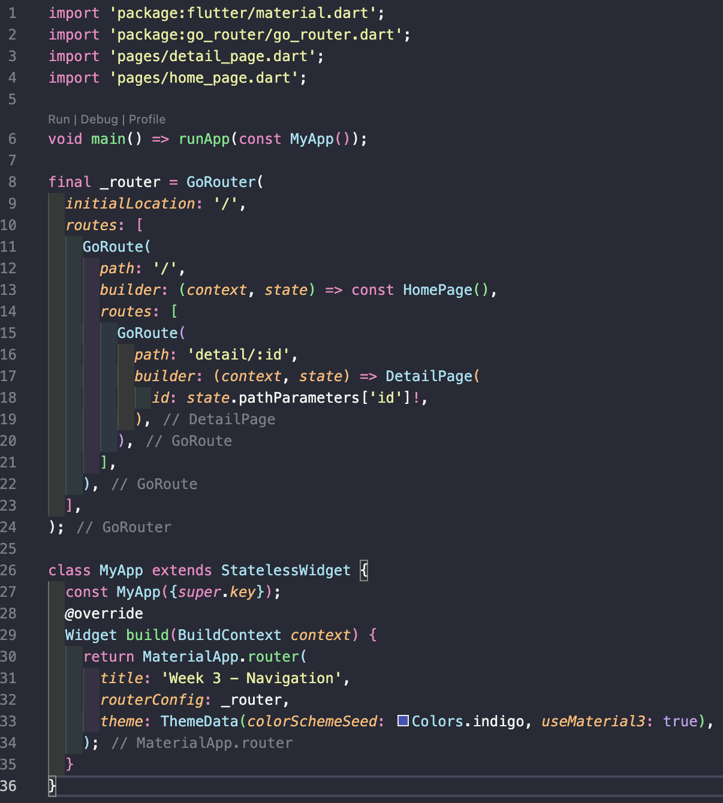 |

### Halaman Home (lib/pages/home_page.dart):

| home_page |
| :---: |
| 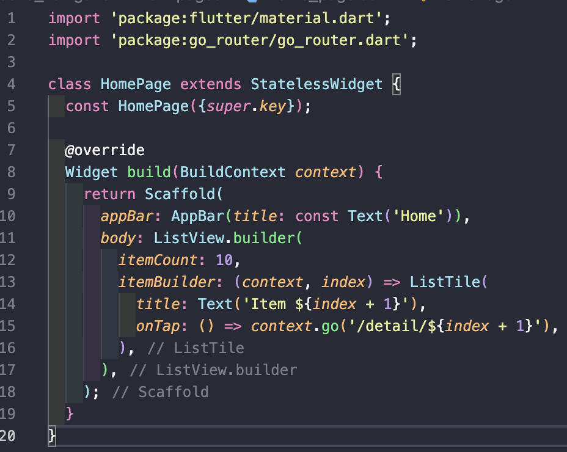 |

### Halaman Detail (lib/pages/detail_page.dart):

| detail_page |
| :---: |
| 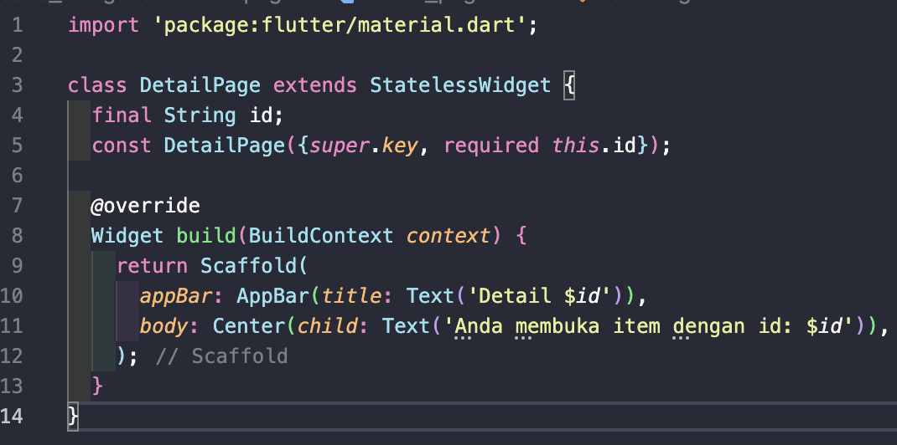 |

### Jalankan dan amati.

| home_page | detail_page |
| :---: | :---: |
| 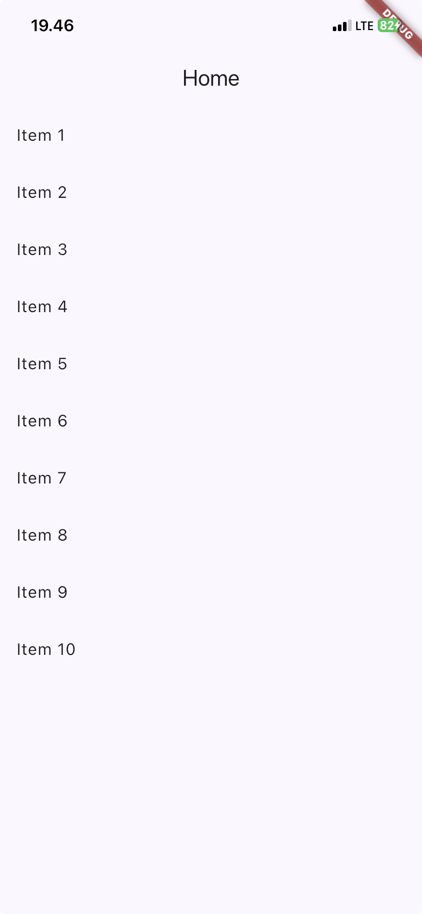 | 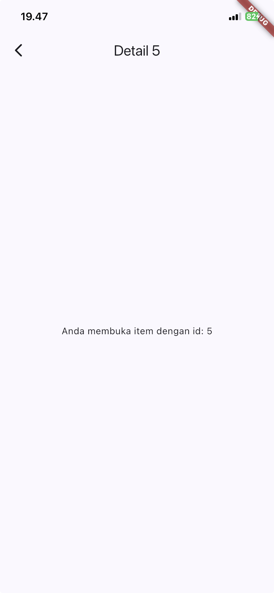 |

**Penjelasan:**
Aplikasi dijalandkan dengan membuka item dari halaman Home. Waktu item dipilih, aplikasi berpindah ke halaman Detail dan menampilkan ID item yang dipilih.

Praktikum berhasil menggunakan GoRouter untuk membuat navigasi halaman. Penggunaan path parameter memungkinkan halaman Detail menerima ID item secara dinamis.

## Praktikum 2 — Aplikasi ToDo dengan Riverpod

## Struktur folder

| struktur |
| :---: |
| 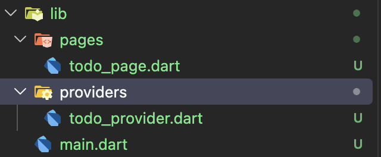 |

### Bungkus aplikasi dengan ProviderScope di lib/main.dart:

| code_main |
| :---: |
| 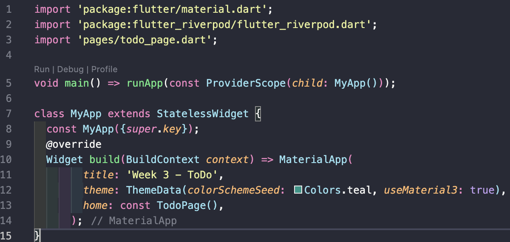 |

### Buat state dan provider (lib/providers/todo_provider.dart):

| code_todo_provider |
| :---: |
| 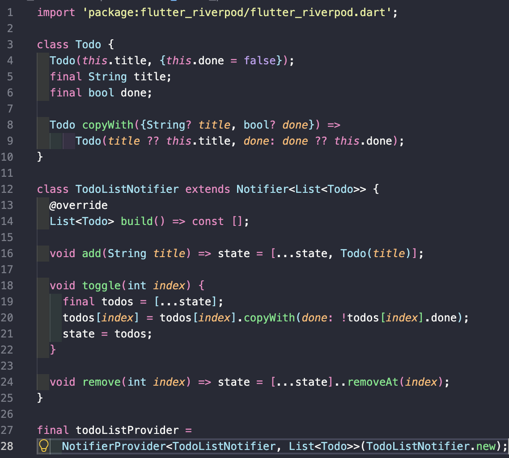 |

### Tampilkan dengan ConsumerWidget (lib/pages/todo_page.dart):

| code_todo_page_1 | code_todo_page_2 |
| :---: | :---: |
| 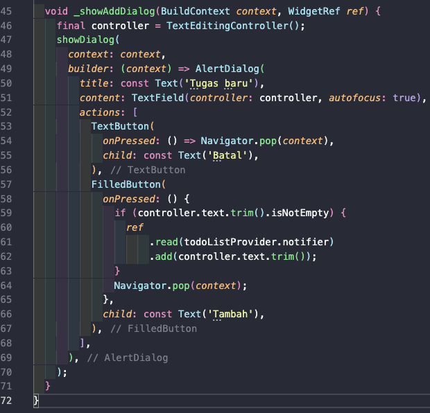 | 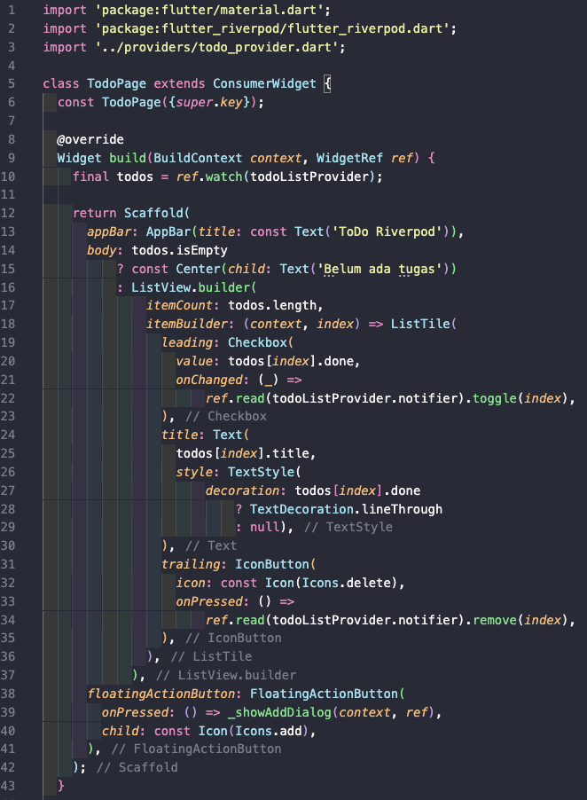 |

## AsyncValue: loading, error, success

### Struktur folder:
| struktur |
| :---: |
| 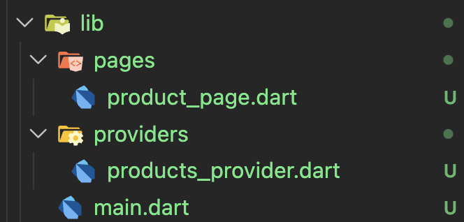 |

### Halaman Home (lib/pages/product_page.dart):

| product_page |
| :---: |
| 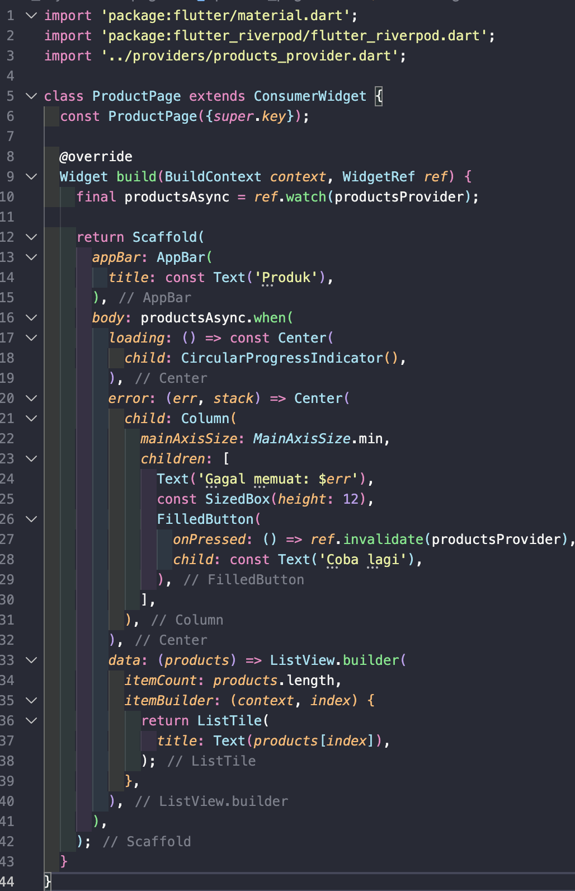 |

### Halaman Detail (lib/providers/product_provider.dart):

| product_providers |
| :---: |
| 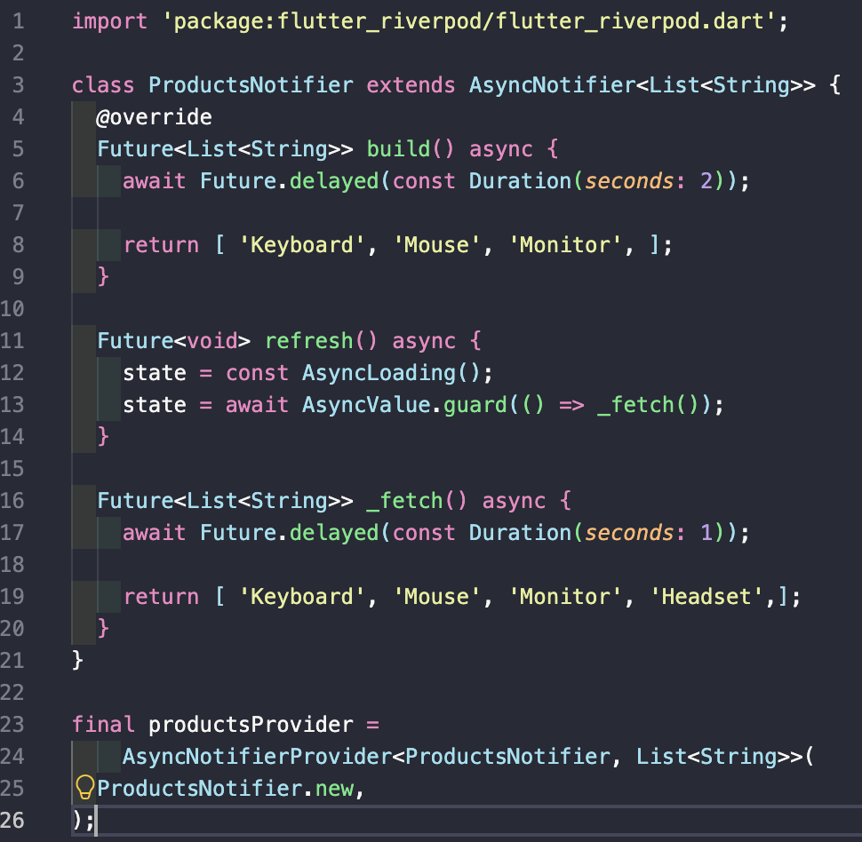 |