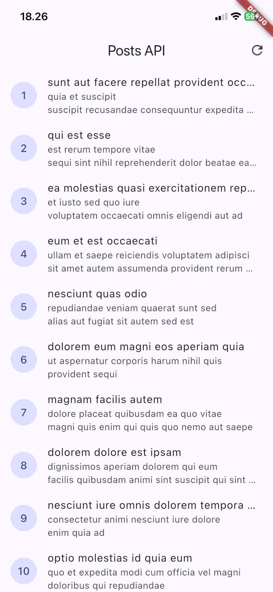
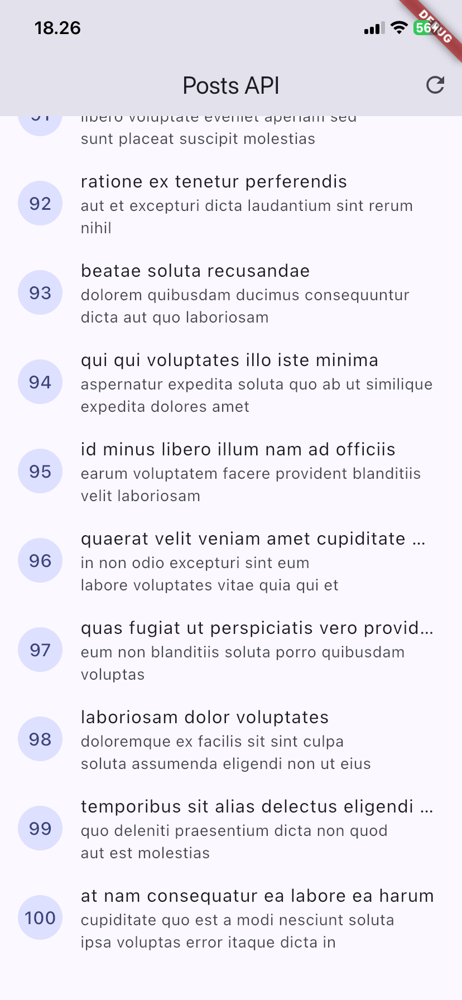
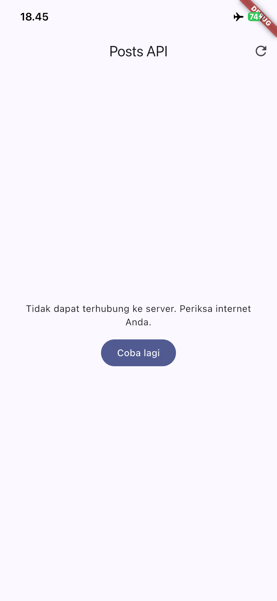
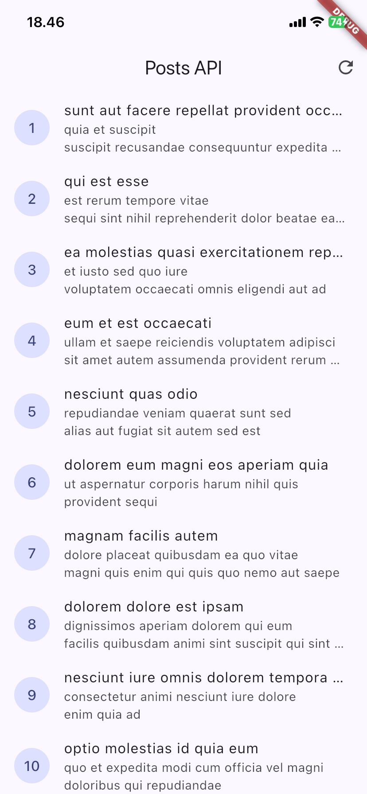
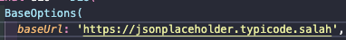

# Week 4 - Networking & REST API

Aplikasi Flutter yang menampilkan daftar data dari REST API (JSONPlaceholder `/posts`) melalui repository + Riverpod, dikerjakan sesuai codelab "#04 | Networking & REST API".

## Fitur utama

- Model `Post` dengan `fromJson` aman null.
- Dio terpusat (base URL, timeout 10 detik, header, `LogInterceptor`) di `lib/data/api_client.dart`.
- `PostRepository`: `fetchPosts`, `fetchPostsPage` (`_page` dan `_limit`), `fetchPost`.
- `PostListPage`: empat state (loading, error + tombol "Coba lagi", empty, success), refresh.
- `PagedPostPage`: infinite scroll 10 item per halaman, guard request ganda, indikator akhir data.
- Halaman detail `/post/:id` dengan GoRouter (data dari list yang sudah dimuat, atau via repository bila dibuka langsung).
- AI Challenge: `Comment`, `CommentRepository`, `commentListProvider` (lihat `docs/ai-challenge.md`).

## Uji tiga skenario error

1. Jalankan aplikasi dengan internet normal, amati loading lalu daftar 100 posts.

| uji_internet_normal | uji_internet_normal |
|:---:|:---:|
|  |  |

2. Matikan internet (mode pesawat), tekan refresh, amati pesan ramah + tombol "Coba lagi". Nyalakan kembali internet, tekan Coba lagi.

| internet_mati | internet_nyala |
|:---:|:---:|
|  |  |

3. Sementara ubah baseUrl menjadi URL salah, amati pesan error koneksi. Kembalikan setelah uji.

| url_salah | hasil |
|:---:|:---:|
|  |  |

## AI Challenge

